# lab2-kubernetes
Kubernetes lab demonstrating pods, services, and DNS-based service 

## Screenshot Walkthrough

### 01 – Value and Zone Configuration
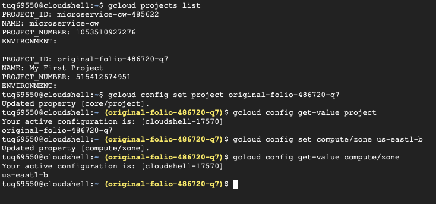
This screenshot shows the active Google Cloud project and compute zone being set and verified before creating the Kubernetes cluster.

---

### 02 – Creating the Cluster
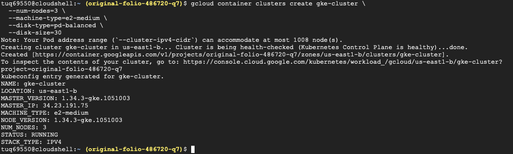
This screenshot captures the command used to create the GKE cluster, including node count and machine configuration.

---

### 03 – Cluster List
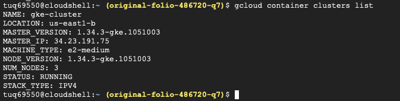
This screenshot confirms that the GKE cluster was successfully created and is running in the specified zone.

---

### 04 – Nodes
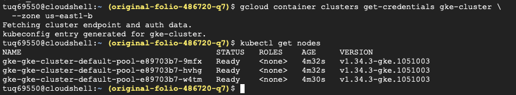
This screenshot shows the Kubernetes nodes in the cluster and confirms they are all in the Ready state.

---

### 05 – Authentication Login

This screenshot shows authentication being verified so that kubectl can interact with the Kubernetes cluster.

---

### 06 – Creating Pods
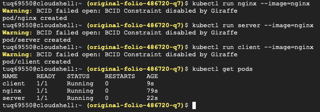
This screenshot shows the creation of the nginx, server, and client pods within the Kubernetes cluster.

---

### 07 – Verifying Nodes
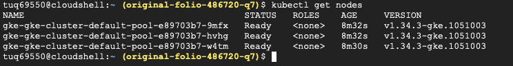
This screenshot confirms that the nodes are active and ready to schedule and run pods.

---

### 08 – Localhost Curl Test
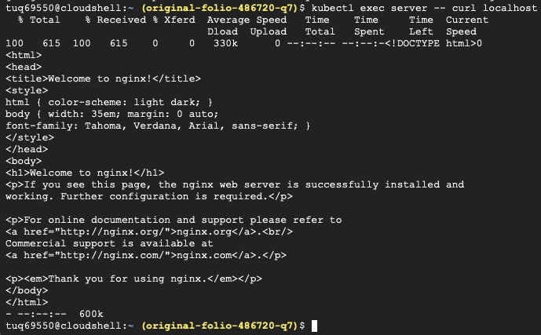
This screenshot verifies that the nginx web server is running correctly inside the server pod by accessing it through localhost.

---

### 09 – Server Pod IP
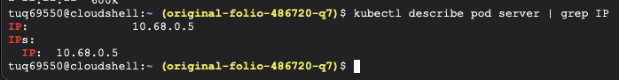
This screenshot displays the internal IP address assigned to the server pod, which is needed for direct pod-to-pod communication.

---

### 10 – Pod-to-Pod Communication
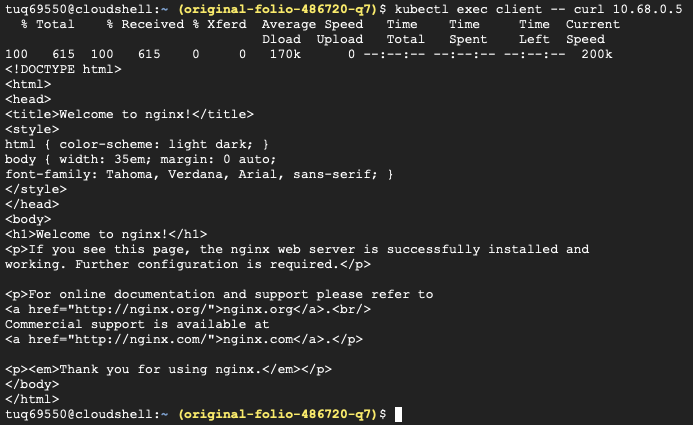
This screenshot demonstrates successful communication from the client pod to the server pod using the server pod’s internal IP address.

---

### 11 – Server Service Created
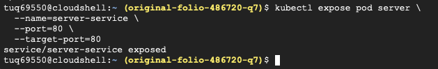
This screenshot shows the creation of a Kubernetes Service named server-service to expose the server pod internally.

---

### 12 – Listing Services
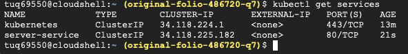
This screenshot confirms that the server-service appears in the list of Kubernetes services with an assigned ClusterIP.

---

### 13 – Describe Service
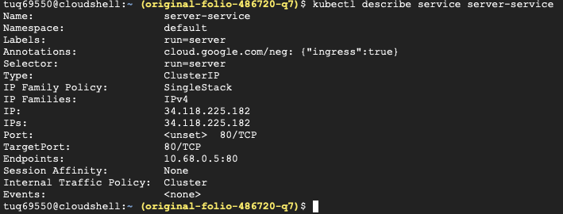
This screenshot provides detailed information about the server-service, including its ClusterIP and backend pod endpoints.

---

### 14 – DNS Client Created
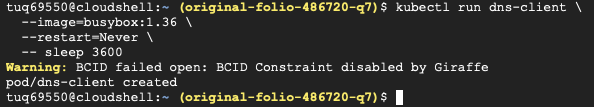
This screenshot shows the creation of a DNS client pod used to test Kubernetes DNS-based service discovery.

---

### 15 – DNS Lookup
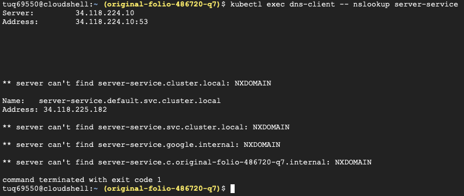
This screenshot demonstrates DNS resolution of the service name server-service to its ClusterIP address.

---

### 16 – Service Name Curl
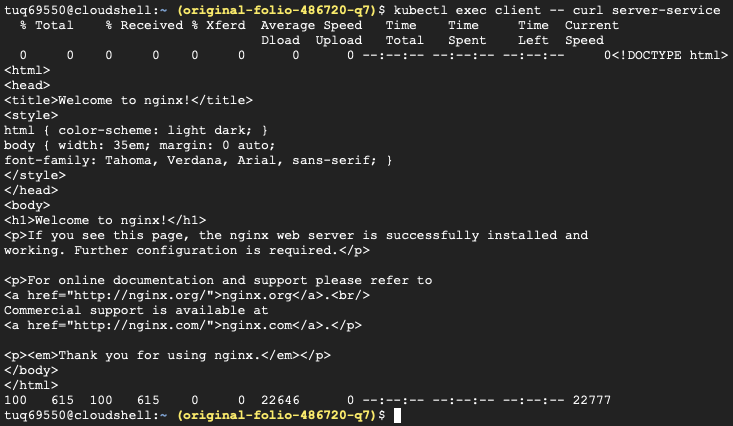
This screenshot confirms that the client pod can successfully access the server using the service name instead of a pod IP.

---

### 17 – Multiple Service Requests
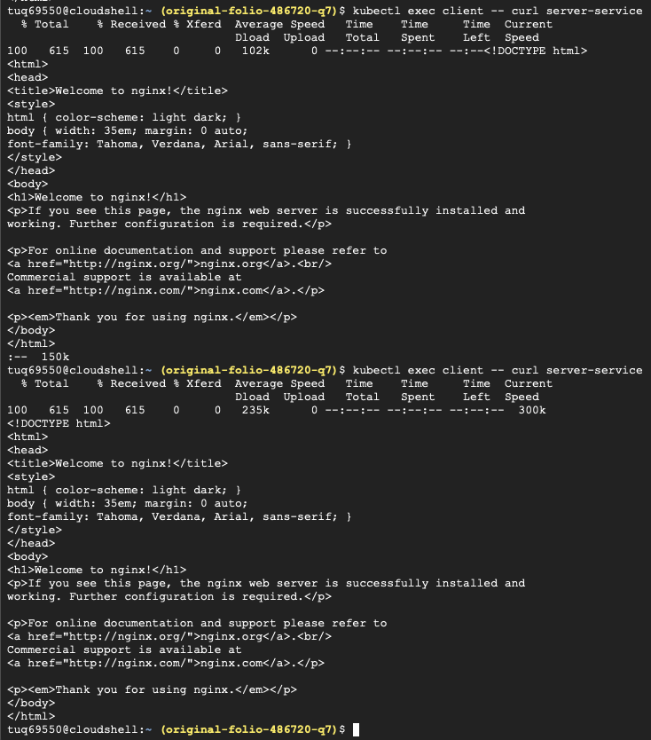
This screenshot shows multiple successful requests sent through the service, confirming stable routing.

---

### 18 – Resource Deletion
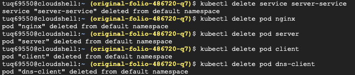
This screenshot documents the deletion of Kubernetes resources such as pods and services as part of cleanup.

---

### 19 – GKE Cluster Deletion
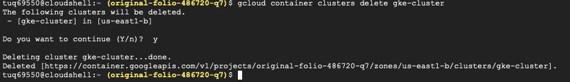
This screenshot confirms the deletion of the GKE cluster to ensure no resources remain running after the lab assignment.
